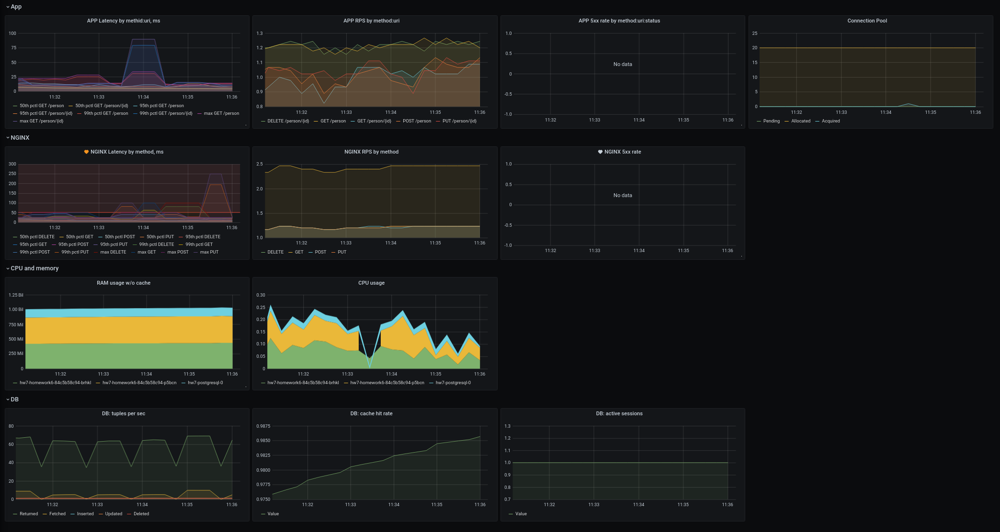
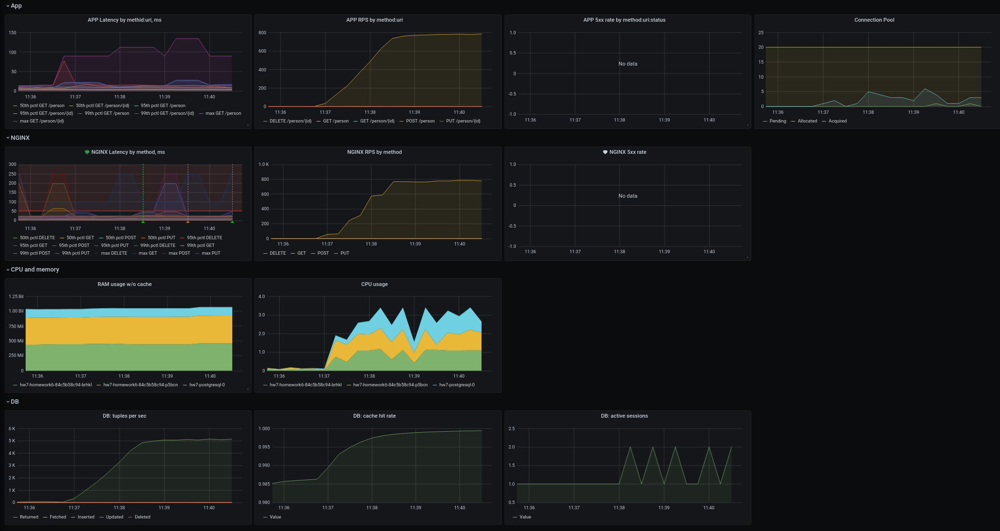
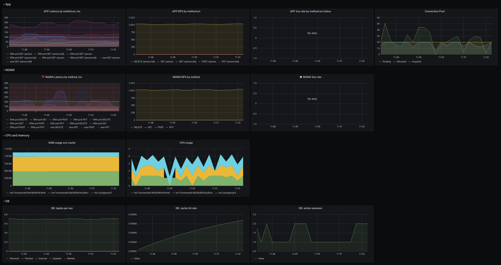
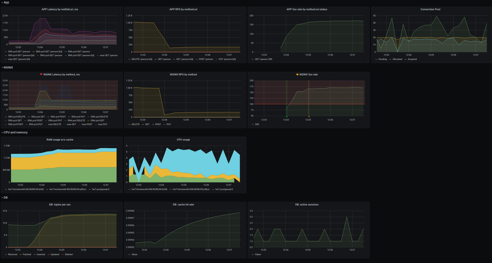

# Homework 7

Application is instrumented to provide metrics by:

* Including micrometer-registry-prometheus dependency, according to [Spring Boot guide](https://docs.spring.io/spring-boot/docs/2.4.0-RC1/reference/html/production-ready-features.html#production-ready-metrics-getting-started)
* Configuring in [application.yaml](src/main/resources/application.yaml) Actuator to:
  * expose `prometheus` and `metrics` endpoints
  * configuring `http.server.requests` metrics to [provide a percentiles-histogram](https://docs.spring.io/spring-boot/docs/2.4.0-RC1/reference/html/production-ready-features.html#per-meter-properties)
* Registering metrics via a [service monitor](chart/templates/servicemonitor.yaml)

Grafana dashboard is implemented to display:
* Application-exported metrics: latency, RPS and error rate - by {HTTP METHOD} : {URI} combination
* Ingress controller-provided metrics: latency, RPS and error rate - by HTTP METHOD
* CPU and memory usage by applicati on PODs
* Usage of DB connections to connection pool
* DB-provided metrics: returned/fetched/inserted/updated/deleted tuples, cache hit rate, active sessions

Alerts are triggered if:
* average value of the "99th percentile NGINX latency" for any HTTP method during a minute exceeds 50 ms
* the number of 5xx responses as reported by NGINX for the last 5 minutes exceeds 100

 
Three rows are inserted to the DB table, postman scenario (create/get/list/update/delete) is executed with a single thread:

Postman scenario keeps running + executing the `list` request using 5 threads, `while :; do ab -n 1000000 -c 5 arch.homework/otusapp/audintsev/person; sleep 1; done`:

Postman scenario keeps running + executing the `list` request using 50 threads, `while :; do ab -n 1000000 -c 50 arch.homework/otusapp/audintsev/person; sleep 1; done`:

And here I drop a table in the DB while the `ab` test using 50 threads is running:

