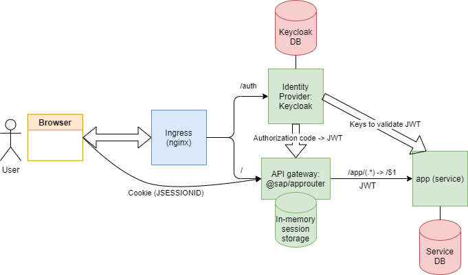

# Homework for lessons 6, 7 and 11 (see tags) of the [Otus "Software Architect" course](https://otus.ru/lessons/arhitektor-po/) 

## Deployment

Deploying:
```
git clone https://github.com/audintsev/otus-architect-homework.git
cd otus-architect-homework
git checkout hw12

kubectl create ns udintsev
helm install -n udintsev hw12 ./chart
```

Installation takes rather long, because helm also needs to perform initializations in hooks:
* Create schema for the app (needs app-db to start up)
* Create in a realm and a client in Keycloak (needs that Keycloak starts) 

So it's best to observe the progress while deploying (in a different terminal):
```
watch kubectl -n udintsev get all
```

Undeploying:
```
helm uninstall -n udintsev hw12
for pvc in $(kubectl get pvc -n udintsev -o jsonpath='{.items[*].metadata.name}'); do kubectl delete -n udintsev pvc $pvc; done
kubectl delete ns udintsev
```

## Architecture



Features:
* Using [Keycloak](https://www.keycloak.org/) as Identity Provider (IdP)
* Using [@sap/approuter](https://www.npmjs.com/package/@sap/approuter) as API gateway
* Usage of [Nginx Ingress Controller](https://kubernetes.github.io/ingress-nginx/) as edge Ingress Controller is assumed

Logic:
* The user logs in to the [gateway](gateway), which delegates authentication to IdP, leveraging "Authorization Code" flow
* The gateway obtains a JWT token on user's behalf and stores it in its in-memory session storage
* The session between the [gateway](gateway) and browser is tracked using an opaque cookie
* The gateway serves as reverse proxy (and a router) and OpaqueCookie -> JWT cache
* Application proxied by the gateway receives JWT and performs offline validation

After deploying, you can quickly check operation in browser:
* [Keycloak](http://arch.homework/auth/) (login as admin/admin), [create a user in 'myrealm' realm](http://arch.homework/auth/admin/master/console/#/realms/myrealm/users)
* [Access application](http://arch.homework/app/hello), logging in as the created user

## Invoking the postman collection

Run from the root of the cloned repo:
```
newman run postman_collection.json 
```

The scenario is:

* IdP admin creates two users and sets passwords for them
* User1 logs in: access app -> redirected to IdP's login page -> logs in to IdP (POST a login form) ->
redirected with authorization code to the gateway -> redirected to the original app URL (authenticated)
* User1 registers in the application
* User1 changes his profile in the app
* User1 logs out
* User2 logs in (same sequence as for User1)
* User2 registers in the app
* User2 attempts to read and change profile of User1 (both fails with status code 403/Forbidden)

## Application

Application-wise, this repository showcases the following technologies being used in one simple web application:

* Reactive stack: Spring WebFlux and R2DBC
* Testcontainers to run integration tests with Postgresql
* Spring REST Docs to generate API documentation out of API tests

TODO:

* Fix API tests and generating documentation
* Building native image
* CI with Github actions (possibly publishing generated API docs as a Github pages site)
  
Comments:

* I don't use embedded DB migrations (managed by Liquibase or Flyway). Tests create schema defined in
[schema.sql](app/src/test/resources/schema.sql). When running _productively_ schema needs to be pre-created
by a Kubernetes job. The reasons for choosing this design are:
  * I'd like to experiment with Kubernetes jobs
  * neither Liquibase nor Flyway can natively work R2DBC connections
  * most importantly, my current impression is that app-managed DB migrations feel alien in the new
microservices/cloud native world: with app-managed migrations an application typically refuses to run if actual schema
version doesn't match what application expects; but that's exactly what seems to happen more often than not:
a new application version makes some additions to the schema (e.g. a new column), and the two versions - the old
one and the new one - co-exist in the same deployment. 

## Links

### Application

* [R2DBC on Spring Framework](https://docs.spring.io/spring-framework/docs/5.3.0-RC2/reference/html/data-access.html#r2dbc)
* [WebFllux on Spring Framework](https://docs.spring.io/spring-framework/docs/5.3.0-RC2/reference/html/web-reactive.html#spring-webflux)
* [R2DBC support in Testcontainers](https://www.testcontainers.org/modules/databases/r2dbc/)
* [Spring REST Docs](https://docs.spring.io/spring-restdocs/docs/current/reference/html5/) 
* [Spring Security OAuth2 and Febflux](https://docs.spring.io/spring-security/site/docs/5.4.1/reference/html5/#webflux-oauth2)
* [Spring Security OAuth2 and Febflux: Testing](https://docs.spring.io/spring-security/site/docs/5.4.1/reference/html5/#webflux-testing-jwt)
* [Testing with fake authorization server](https://engineering.pivotal.io/post/faking_oauth_sso/)
* [Baeldung: OAuth Resource Server](https://www.baeldung.com/spring-security-oauth-resource-server)


### Keycloak

* https://github.com/keycloak/keycloak-documentation/blob/master/server_development/topics/admin-rest-api.adoc
* https://www.keycloak.org/docs-api/5.0/rest-api/index.html

## Gathering pod metrics for CPU and memory usage

Container metrics can be provided by [cAdvisor](https://github.com/google/cadvisor),
available metrics are documented [here](https://github.com/google/cadvisor/blob/master/docs/storage/prometheus.md).

Prometheus has a corresponding [guide](https://prometheus.io/docs/guides/cadvisor/)

When using [prometheus stack](https://github.com/prometheus-community/helm-charts/tree/main/charts/kube-prometheus-stack),
collecting container metrics is enabled out of the box.

Some further links:
* https://coreos.com/blog/monitoring-kubernetes-with-prometheus.html
* https://itnext.io/k8s-monitor-pod-cpu-and-memory-usage-with-prometheus-28eec6d84729
* https://github.com/kubernetes/kube-state-metrics/blob/master/docs/pod-metrics.md

## Gathering Postgres metrics

[Postgres exporter](https://github.com/wrouesnel/postgres_exporter) can be used to export metrics.

There is a [helm chart](https://github.com/prometheus-community/helm-charts/tree/main/charts/prometheus-postgres-exporter)
for prometheus to install the exporter.

We're using a bitnami chart to install postgresql, and this chart can also
[enable the exporter](https://github.com/bitnami/charts/tree/master/bitnami/postgresql#metrics),
we only need to add this to [values.yaml](chart/values.yaml):

```yaml
postgresql:
  metrics:
    enabled: true
    serviceMonitor:
      enabled: true
      interval: 15s
```

The exporter exposes internal DB views, so available
metrics are essentially documented [here](https://www.postgresql.org/docs/9.2/monitoring-stats.html)

[Sample Grafana dashboard](https://grafana.com/grafana/dashboards/9628)

## DEV-specific

My 'dev' cluster exposes endpoint `arch.labs`, this section provides some shortcuts for my convenience.

Deploying:
```
helm install -n udintsev --create-namespace hw12 ./chart --set "ingress.host=arch.labs"
```

Or, using an alternative endpoint (I do that for my 'dev' cluster):
```
newman run --env-var "baseUrl=http://arch.labs" postman_collection.json
```

Building and pushing (app build requires Java 15):

```
cd app
./gradlew bootBuildImage --imageName=udintsev/hw12-app:latest
docker push udintsev/hw12-app:latest

cd ../gateway
docker build -t udintsev/hw12-gw:latest .
docker push udintsev/hw12-gw:latest
```
